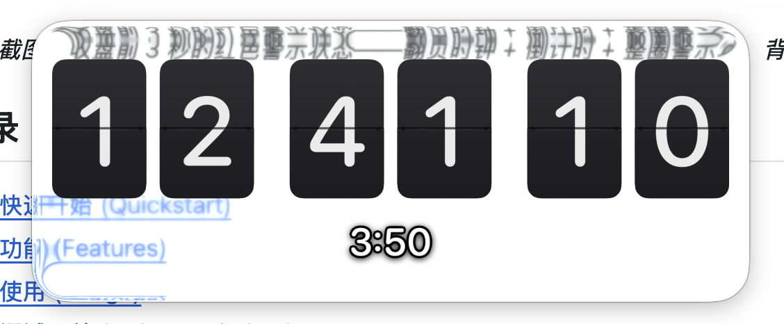

# TradingClock

> 常驻桌面的机械翻页时钟，为 5 分钟价格行为交易而生 —— 秒级对时、下根 K 线收盘倒计时、临界闪光提醒，Liquid Glass 全透明悬浮于盘面之上。


做 5 分钟级别的价格行为交易，你需要随时知道「这根 K 还剩多久收盘」，并在最后几秒保持专注——而不是盯着角落里的小数字心算。TradingClock 把 **翻页时间 + 收盘倒计时 + 临界闪光** 压进一块全透明玻璃，浮在交易软件上：

```
╭────────────────────────────────────╮
│       ██  ██   ██  ██   ██  ██     │   ← HH MM SS 翻页
│       1  2    5  9    4  3         │
│             3:42                   │   ← 距下根 5 分 K 收盘
╰────────────────────────────────────╯
```


*实机截图：玻璃全透明，下方内容透过窗口可见；翻页卡与黑描边倒计时在亮背景上依然清晰。*

## 目录

- [快速开始 (Quickstart)](#快速开始-quickstart)
- [功能 (Features)](#功能-features)
- [使用 (Usage)](#使用-usage)
- [调试开关 (Debug switches)](#调试开关-debug-switches)
- [验证数据 (Benchmarks & Evidence)](#验证数据-benchmarks--evidence)
- [边界与 FAQ (Boundaries & FAQ)](#边界与-faq-boundaries--faq)
- [设计文档 (Design doc)](#设计文档-design-doc)
- [参与贡献 (Contributing)](#参与贡献-contributing)
- [许可 (License)](#许可-license)

## 快速开始 (Quickstart)

要求：macOS 26（Tahoe）+ Xcode 26。

**安装 (Install)**

```bash
git clone git@github.com:BoyceFong/trading-clock.git
cd trading-clock
Scripts/build.sh --install
```

**预期效果**：装入 `/Applications` 并启动后——

- 一只**无头**圆角玻璃窗悬浮桌面（没有红绿灯按钮），透过它可以看见下方窗口
- 数字每秒机械翻页，下方倒计时 `M:SS` 同步走
- 按住窗口拖到屏幕边/角附近，松手即自动吸附

**30 秒看一次收盘闪光**（把 K 线压缩到 30 秒演示）：

```bash
pkill -x TradingClock
TC_CANDLE_LEN_SECONDS=30 /Applications/TradingClock.app/Contents/MacOS/TradingClock
```

每根 K 的**倒数 3 秒黄色闪 3 次**、**最后 5 秒红色闪 5 次**，每秒一次。看完恢复正常运行即可。

下一步：设计细节见 [docs/DESIGN.md](docs/DESIGN.md)。

## 功能 (Features)

| 你需要 | 它给你的 |
|---|---|
| 精确对时 | Solari 翻页 `HH MM SS`（24h，无冒号），墙钟逐秒对齐零漂移；睡眠唤醒、系统改钟即时校准 |
| 感知收盘 | 下根 5 分 K 倒计时 `M:SS`，数字带黑描边，白色盘面上也清晰 |
| 临界提醒 | 剩 30 秒黄闪 3 秒、最后 5 秒红闪 5 秒，每秒 1 次脉冲；**全周等亮**高亮环 + 距离场弥散光晕（同距亮度偏差 ≤1/255，数值验证） |
| 不遮盘面 | Liquid Glass 全透明玻璃，**失焦不变糊**；系统开启「降低透明度」时自动降级不透明 |
| 随意摆放 | 全窗可拖、8 向手柄缩放且内容等比、屏幕边/角 14pt 自动吸附、位置尺寸记忆 |
| 常驻随手 | 菜单栏常驻、`⌃⌘K` 显隐（3 组预设可换）、开机自启、右键菜单操作全部 |
| 双语 | 菜单跟随系统语言（简体中文 / English） |

闪光光晕经过数值验证——在上/下/左/右/圆角同距离处亮度恒等（偏差 ≤1/255）：


*黑/白四象限对照：整圈等宽等亮，白芯在任意底色可读。*

## 验证数据 (Benchmarks & Evidence)

| 指标 | 数值 | 手段 |
|---|---|---|
| 光晕全周均匀性 | 同距采样 α 偏差 ≤1/255 | `--glow-preview` 六点采样（上/下/左/右/两角） |
| 翻页动画帧率 | 60–120fps（≥24fps 要求的 2.5–5×） | `KeyframeAnimator` 显示刷新率插值 + 4× 位图字面 |
| 单次翻页时长 | ≈0.32s 四段物理摆落曲线 | `Theme.flipTip/Fall/Whip/Land` |
| 时间对齐 | 零漂移 | 逐秒边界重算，非 interval 累加；睡眠/改钟即时 resync |
| K 线相位边界 | 14/14 用例通过 | 含两处整 5 分收盘点的独立测试脚本 |

## 使用 (Usage)

| 操作 | 说明 |
|---|---|
| `⌃⌘K` | 显示 / 隐藏时钟（右键 › 快捷键 可换 `⌃⌥⌘K` / `⌥⌘K`） |
| 拖动窗口 | 按住任意处拖动，靠近屏幕边/角自动吸附 |
| 窗口边缘 | 边缘 8pt 内拖拽缩放（8 向），内容始终等比 |
| 右键窗口 | 隐藏窗口 / 开机时启动 / 快捷键 / 退出 |
| 菜单栏时钟图标 | 显示/隐藏、开机时启动、快捷键、退出（勾选状态双向同步） |

## 调试开关 (Debug switches)

| 开关 | 作用 |
|---|---|
| `TC_CANDLE_LEN_SECONDS=30` | 把 K 线压到 N 秒，快速演练闪光节奏 |
| `TC_FLIP_SLOW=1` | 翻页放慢 10 倍，观察机械动作 |
| `TC_GLASS_MODE=material\|solid` | 玻璃降级调试图形 |
| `--glow-preview [目录]` | 渲染光晕均匀性验证图并退出 |
| `--ui-preview [目录]` | 离屏渲染应用 UI 截图（README 用图即出自它） |

## 边界与 FAQ (Boundaries & FAQ)

**Limitations（诚实边界，它不适合什么）**——

- **不是交易信号工具**：只做视觉计时提醒，不接行情、不判断入场
- **无声音/系统通知**：全部靠窗口视觉（对盯盘是特性，不是缺陷）
- **K 线边界按本机时钟整 5 分**（:00 :05 …）对齐。图表按 UTC 对齐且你所在时区非整小时偏移（如 UTC+5:30）时，请注意边界差异
- **需要 macOS 26**：Liquid Glass 是系统材质，无法降级到旧系统

**FAQ**

- **能不能改成 1 分钟 / 其他周期？** 当前产品固定 5 分钟边界（调试开关可压缩周期，但闪光阈值按 5 分钟设计）。多周期支持在考虑中，欢迎 issue 表态。
- **为什么不用声音提醒？** 声音会干扰盯盘专注，且交易环境常静音。窗口闪光是余光可捕、又不打断心流的通道。
- **全局热键和别的 app 冲突了怎么办？** 右键 › 快捷键，一键换 `⌃⌥⌘K` / `⌥⌘K` 预设（已知 JetBrains 选装 *macOS System Shortcuts* keymap 时 `⌃⌘K` 会撞 ShowBookmarks）。
- **窗口失焦后玻璃会变糊吗？** 不会。系统材质默认失焦起雾，我们做了精确中和，实现细节见 [docs/DESIGN.md](docs/DESIGN.md)。

## 设计文档 (Design doc)

架构、时间驱动、翻页机构、光晕数学、Liquid Glass 集成的完整设计与决策记录 → **[docs/DESIGN.md](docs/DESIGN.md)**

## 参与贡献 (Contributing)

个人盘面工具，欢迎 issue / PR——尤其是闪光节奏、翻页手感这类可调参数的意见。

## 支持与反馈 (Support)

反馈与求助统一走本仓库 [Issues](https://github.com/BoyceFong/trading-clock/issues)：bug 报告请附 macOS 版本与复现步骤，功能建议直接描述使用场景即可。

## 安全 (Security)

本 app 不联网、不采集数据、不处理任何凭据——仅读系统时钟。若发现安全隐患，请通过 [Issues](https://github.com/BoyceFong/trading-clock/issues) 私密披露或联系维护者，勿提交公开 exploit。

## 许可 (License)

暂未指定开源许可证（个人项目，保留全部权利）。如需复用或二次分发，请先开 issue 联系。
